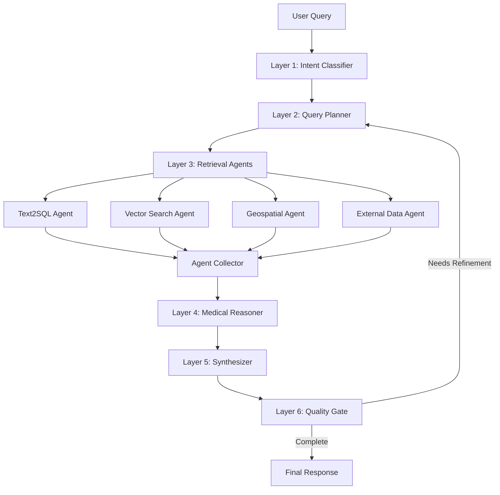

# 🏥 VF Healthcare Intelligence Agent

> **AI-Powered Healthcare Access Intelligence for Global Health Equity**

An agentic AI system that analyzes healthcare facility data, identifies service gaps, and provides actionable insights for NGOs and policymakers working to improve healthcare access in underserved regions.

[](https://www.python.org/downloads/)
[](https://github.com/langchain-ai/langgraph)
[](https://fastapi.tiangolo.com/)
[](https://nextjs.org/)

---

## 📋 Table of Contents

- [Overview](#-overview)
- [Key Features](#-key-features)
- [Architecture](#-architecture)
- [Quick Start](#-quick-start)
- [Deploy to Databricks](#-deploy-to-databricks)
- [Usage](#-usage)
- [API Documentation](#-api-documentation)
- [Project Structure](#-project-structure)
- [Configuration](#-configuration)
- [Development](#-development)
- [Example Queries](#-example-queries)
- [Contributing](#-contributing)
- [License](#-license)

---

## 🎯 Overview

The VF Healthcare Intelligence Agent is a sophisticated AI system designed to help healthcare planners, NGOs, and policymakers make data-driven decisions about healthcare resource allocation. Built for the Virtue Foundation's global healthcare access initiative, it currently focuses on Ghana's healthcare landscape.

### Problem Statement

Healthcare planners in underserved regions face critical challenges:
- **Data Fragmentation**: Healthcare facility data is scattered and unstructured
- **Service Gaps**: Difficulty identifying underserved areas ("medical deserts")
- **Resource Allocation**: Limited tools for optimizing NGO project placement
- **Data Quality**: Inconsistent facility information and missing data
- **Analytical Barriers**: Technical expertise required for complex geospatial analysis

### Our Solution

An AI agent that speaks natural language, understands medical terminology, and provides instant insights:
- 🗣️ **Natural Language Interface**: Ask questions like "Where are cardiology medical deserts?"
- 🧠 **Medical Intelligence**: Automatically expands medical terms and validates data
- 📊 **Multi-Source Analysis**: Combines structured data, semantic search, geospatial analysis, and WHO benchmarks
- 🗺️ **Interactive Visualization**: Real-time map highlighting of facilities and service gaps
- 🔍 **Citation Tracking**: Every claim backed by source evidence
- ⚡ **Self-Correcting**: Quality gate ensures accurate, complete responses

---

## ✨ Key Features

### 🤖 Intelligent Query Processing

- **Multi-Agent Orchestration**: Parallel execution of specialized agents (Text2SQL, Vector Search, Geospatial, External Data)
- **Medical Term Expansion**: Understands informal queries ("heart doctor" → "cardiology")
- **Intent Classification**: Automatically categorizes queries into 11 categories
- **Query Decomposition**: Breaks complex questions into atomic sub-tasks

### 🏥 Healthcare-Specific Capabilities

- **Medical Desert Detection**: Identifies underserved geographic areas by specialty
- **Anomaly Detection**: Flags data quality issues (e.g., cardiology without equipment)
- **WHO Benchmarking**: Compares metrics against international guidelines
- **Workforce Analysis**: Doctor-to-bed ratios, specialist distribution
- **NGO Coordination**: Identifies overlapping projects and coverage gaps

### 🗺️ Geospatial Intelligence

- **Distance Calculations**: Find nearest facilities by specialty
- **Coverage Analysis**: Identify areas beyond X km from any facility
- **Regional Comparisons**: Compare service availability across districts
- **Population Integration**: Factor in demographic data for need assessment

### 🔬 Data Quality & Validation

- **Evidence-Based Validation**: Cross-references claims against actual facility data
- **Anomaly Flagging**: Detects inconsistent or suspicious entries
- **Citation Tracking**: Full provenance for every data point in responses
- **Quality Gate**: Self-correcting feedback loop ensures response quality

### 💻 User Interfaces

- **Interactive Map**: Next.js + MapLibre GL for visual exploration
- **REST API**: FastAPI backend for integration with other systems
- **CLI**: Rich terminal interface for power users and testing
- **Real-Time Chat**: Conversational interface with pipeline visibility

---

## 🏗️ Architecture

### 6-Layer LangGraph Pipeline



### Layer Descriptions

| Layer | Component | Purpose | Key Technologies |
|-------|-----------|---------|-----------------|
| **1** | Intent Classifier | Categorize query & select agents | GPT-4o, Pydantic |
| **2** | Query Planner | Expand medical terms, decompose tasks | GPT-4o, Medical Ontology |
| **3a** | Text2SQL Agent | Structured queries on facility DB | DuckDB, SQL generation |
| **3b** | Vector Search Agent | Semantic search on free-form text | FAISS, OpenAI embeddings |
| **3c** | Geospatial Agent | Distance calculations, coverage gaps | Geopy, Haversine |
| **3d** | External Data Agent | WHO guidelines, population data | External APIs (mocked) |
| **4** | Medical Reasoner | Validate claims, detect anomalies | GPT-4o, Clinical logic |
| **5** | Synthesizer | Generate natural language answer | GPT-4o, Citation tracking |
| **6** | Quality Gate | Check completeness, trigger refinement | GPT-4o, Feedback loop |

### Technology Stack

**Backend**
- **LangGraph**: Multi-agent orchestration and state management
- **OpenAI GPT-4o**: Natural language understanding and generation
- **FAISS**: Vector similarity search (Facebook AI Similarity Search)
- **DuckDB**: In-memory SQL database for rapid analytics
- **FastAPI**: Modern Python API framework with automatic OpenAPI docs
- **Pydantic**: Data validation and settings management

**Frontend**
- **Next.js 15**: React framework with App Router
- **TypeScript**: Type-safe JavaScript
- **MapLibre GL**: Interactive map visualization
- **Tailwind CSS**: Utility-first styling

**Data & Storage**
- **CSV Dataset**: 987 healthcare facilities (Ghana v0.3)
- **FAISS Index**: Cached vector embeddings for semantic search
- **PostgreSQL**: Optional production database (DuckDB for dev)

---

## 🚀 Quick Start

### Prerequisites

- **Python**: 3.10 or higher
- **Node.js**: 18 or higher (for frontend)
- **OpenAI API Key**: Required for LLM operations

### Installation

1. **Clone the repository**
   ```bash
   git clone https://github.com/virtue-foundation/ai-healthcare-agent.git
   cd ai-healthcare-agent
   ```

2. **Set up Python environment**
   ```bash
   # Create virtual environment
   python -m venv .venv
   
   # Activate (Windows)
   .venv\Scripts\activate
   
   # Activate (macOS/Linux)
   source .venv/bin/activate
   
   # Install dependencies
   pip install -e .
   ```

3. **Configure environment variables**
   ```bash
   # Copy example .env file
   cp .env.example .env
   
   # Edit .env and add your OpenAI API key
   OPENAI_API_KEY=sk-your-key-here
   ```

4. **Initialize data layer**
   ```bash
   python main.py --init
   ```
   This loads the dataset into DuckDB and builds the FAISS vector index (~2-3 seconds).

5. **Start the API server**
   ```bash
   uvicorn api.server:app --reload --host 0.0.0.0 --port 8000
   ```
   API available at: http://localhost:8000
   
   Interactive docs: http://localhost:8000/api/docs

6. **Start the frontend** (optional, separate terminal)
   ```bash
   cd map
   npm install
   npm run dev
   ```
   Frontend available at: http://localhost:3000

---

## Deploy to Databricks

The app can run as a [Databricks App](https://docs.databricks.com/en/dev-tools/databricks-apps/) so users get a single URL for the map and chat UI.

1. **Upload the repo** to your Databricks workspace (e.g. via `databricks sync` or Import).
2. **Configure the app** in Databricks: set the app’s source path to this repo root. In the app’s environment, set **`NEXT_PUBLIC_API_URL`** to an empty value so the frontend uses relative `/api` (proxied to the FastAPI backend). Optionally set **`DATABRICKS_SECRET_SCOPE`** and store `OPENAI_API_KEY` and `DATABASE_URL` in that scope (see [.env.example](.env.example)).
3. **Deploy** from the Apps UI or CLI: `databricks apps deploy <app-name> --source-code-path /Workspace/Users/.../this-repo`.

The runtime is defined in [app.yaml](app.yaml): it runs the root `npm run start` script, which starts FastAPI on port 8001 and Next.js on port 8000; Next.js proxies `/api/*` to the backend so one URL serves the full UI.

---

## 💡 Usage

### CLI Interface

```bash
# Interactive mode (REPL)
python main.py

# Ask a question
> How many hospitals have cardiology?

# Single query mode
python main.py "Where are the medical deserts for ophthalmology?"

# Verbose logging
python main.py --verbose
```

### REST API

```bash
# Example: POST query to API
curl -X POST http://localhost:8000/api/query \
  -H "Content-Type: application/json" \
  -d '{"question": "How many hospitals have cardiology?"}'

# Response includes:
# - synthesis: Natural language answer
# - citations: Source evidence
# - facility_names: Facilities to highlight on map
# - filters: Map filter parameters
# - metadata: Intent, agents used, timing
```

### Python API

```python
from src.graph import initialize_data, run_query

# One-time setup
initialize_data()

# Process a query
result = run_query("How many hospitals have cardiology?")

print(result["synthesis"])  # Natural language answer
print(result["citations"])  # Source citations
print(result["intent"])     # Query category
print(result["required_agents"])  # Agents used
```

### Frontend Interface

1. Open http://localhost:3000
2. Type your question in the chat panel
3. View results on the interactive map
4. Explore citations and pipeline metadata

---

## 📚 API Documentation

### Endpoints

#### `POST /api/query`

Process a natural language healthcare query.

**Request:**
```json
{
  "question": "How many hospitals have cardiology?"
}
```

**Response:**
```json
{
  "synthesis": "There are 23 hospitals offering cardiology services in Ghana...",
  "citations": [
    {
      "facility_name": "Korle Bu Teaching Hospital",
      "data_source": "text2sql",
      "evidence": "Listed specialties include: cardiology, surgery, pediatrics"
    }
  ],
  "intent": "basic_lookup",
  "required_agents": ["text2sql", "vector_search"],
  "iteration": 1,
  "elapsed": 4.2,
  "filters": {
    "specialty": "cardiology",
    "types": ["hospital"]
  },
  "facility_names": ["Korle Bu Teaching Hospital", "..."],
  "sql_results": {...},
  "expanded_terms": ["cardiology"]
}
```

#### `GET /health`

Health check endpoint for monitoring.

**Response:**
```json
{
  "status": "healthy",
  "service": "vf-healthcare-agent"
}
```

### Interactive API Docs

- **Swagger UI**: http://localhost:8000/api/docs
- **ReDoc**: http://localhost:8000/api/redoc

---

## 📁 Project Structure

```
vf-healthcare-agent/
├── .cursor/
│   └── rules/
│       └── project.md          # Project rules for AI assistance
│
├── api/
│   ├── server.py               # FastAPI application
│   └── __init__.py
│
├── src/                        # Core intelligence pipeline
│   ├── graph.py                # LangGraph pipeline assembly
│   ├── state.py                # Shared state definition
│   ├── config.py               # Configuration management
│   │
│   ├── nodes/                  # Pipeline layers
│   │   ├── intent_classifier.py
│   │   ├── query_planner.py
│   │   ├── text2sql_agent.py
│   │   ├── vector_search_agent.py
│   │   ├── geospatial_agent.py
│   │   ├── external_data_agent.py
│   │   ├── medical_reasoner.py
│   │   ├── synthesizer.py
│   │   └── quality_gate.py
│   │
│   └── tools/                  # Utility functions
│       ├── sql_executor.py     # DuckDB operations
│       ├── vector_search.py    # FAISS operations
│       ├── geocoding.py        # Geospatial utilities
│       └── medical_hierarchy.py # Medical ontology
│
├── map/                        # Next.js frontend
│   ├── app/
│   │   ├── components/
│   │   │   ├── MapView.tsx
│   │   │   ├── ChatPanel.tsx
│   │   │   ├── LayerPanel.tsx
│   │   │   └── Sidebar.tsx
│   │   ├── page.tsx
│   │   └── layout.tsx
│   ├── public/
│   └── package.json
│
├── prompts_and_pydantic_models/ # Structured outputs
│   ├── medical_specialties.py
│   ├── organization_extraction.py
│   └── facility_and_ngo_fields.py
│
├── data/
│   └── vector_store/           # FAISS index cache
│
├── ghana_dataset/              # Source data
│   └── Virtue Foundation Ghana v0.3 - Sheet1.csv
│
├── scripts/
│   └── prepare_map_data.py     # Data preparation utilities
│
├── main.py                     # CLI entry point
├── pyproject.toml              # Python dependencies
├── .env                        # Environment variables (not committed)
├── .gitignore
└── README.md
```

---

## ⚙️ Configuration

### Environment Variables

Create a `.env` file in the project root:

```bash
# OpenAI Configuration (Required)
OPENAI_API_KEY=sk-your-key-here
OPENAI_MODEL=gpt-4o                    # Default: gpt-4o
EMBEDDING_MODEL=text-embedding-3-small # Default: text-embedding-3-small

# Database Configuration
USE_MOCK_DB=true                       # Use DuckDB (true) or PostgreSQL (false)
DATABASE_URL=                          # PostgreSQL connection string (optional)

# Tracing (Optional)
ENABLE_TRACING=false                   # MLflow tracing for debugging
```

### Pipeline Tuning

Edit `src/config.py`:

```python
# Maximum quality gate refinement iterations
MAX_QUALITY_ITERATIONS = 3

# Vector search configuration
EMBEDDING_DIMENSION = 1536  # text-embedding-3-small
TOP_K_VECTOR_RESULTS = 15   # Number of semantic matches to retrieve
```

---

## 🛠️ Development

### Adding a New Agent

1. Create `src/nodes/new_agent.py`:
   ```python
   from src.state import AgentState
   from typing import Dict, Any
   
   def execute_new_agent(state: AgentState) -> Dict[str, Any]:
       """Execute new agent logic."""
       query = state["query"]
       # Your agent logic here
       return {"new_results": results}
   ```

2. Register in `src/graph.py`:
   ```python
   from src.nodes.new_agent import execute_new_agent
   
   graph.add_node("new_agent", execute_new_agent)
   ```

3. Update routing:
   ```python
   def route_to_agents(state: AgentState) -> List[str]:
       agent_map = {
           # ... existing agents
           "new_agent": "new_agent",
       }
   ```

### Running Tests

```bash
# Run all tests (when implemented)
pytest

# Run specific test file
pytest tests/test_agents.py

# Run with coverage
pytest --cov=src tests/
```

### Code Quality

```bash
# Format code
black src/ api/ main.py

# Type checking
mypy src/ api/

# Linting
ruff check src/ api/
```

---

## 🎯 Example Queries

### Basic Lookup
- "How many hospitals have cardiology?"
- "List all facilities in the Greater Accra region"
- "What services does Korle Bu Teaching Hospital offer?"

### Geospatial Analysis
- "Where are the medical deserts for ophthalmology?"
- "Which region has the most clinics?"
- "Find hospitals within 50km of Kumasi"

### Data Validation
- "Which facilities claim cardiology but lack equipment?"
- "Find hospitals without emergency services"
- "Show facilities with missing specialty data"

### Workforce Analysis
- "What is the doctor-to-bed ratio by region?"
- "Which areas have the lowest specialist density?"
- "Compare nurse staffing levels across districts"

### NGO Coordination
- "Where do NGOs have overlapping projects?"
- "Which underserved areas lack NGO coverage?"
- "Show regions with high NGO density"

### Benchmarking
- "How does Ghana's specialist ratio compare to WHO guidelines?"
- "Are we meeting WHO standards for maternal care facilities?"
- "Compare our coverage to Sub-Saharan Africa averages"

### Anomaly Detection
- "Find facilities with unusual patient-to-doctor ratios"
- "Show hospitals claiming specialties without required equipment"
- "Identify data quality issues in the dataset"

---

## 🤝 Contributing

We welcome contributions from the community! Here's how you can help:

### Reporting Issues

- Use GitHub Issues for bug reports and feature requests
- Include detailed steps to reproduce bugs
- Provide example queries that demonstrate issues

### Development Workflow

1. Fork the repository
2. Create a feature branch (`git checkout -b feature/amazing-feature`)
3. Make your changes with clear commit messages
4. Add tests for new functionality
5. Ensure all tests pass and code is formatted
6. Submit a Pull Request

### Code Review Process

- All PRs require at least one review
- CI/CD checks must pass (formatting, linting, tests)
- Documentation must be updated for new features
- Breaking changes require discussion in issues first

---

## 📄 License

This project is licensed under the MIT License - see the [LICENSE](LICENSE) file for details.

---

## 🙏 Acknowledgments

- **Virtue Foundation**: For the mission and healthcare dataset
- **LangChain/LangGraph**: For the powerful agent orchestration framework
- **OpenAI**: For GPT-4o and embedding models
- **Healthcare Planners**: For feedback and real-world requirements
- **Open Source Community**: For the amazing tools that made this possible

---

## 📞 Contact & Support

- **Project Lead**: Virtue Foundation Healthcare Team
- **Issues**: [GitHub Issues](https://github.com/virtue-foundation/ai-healthcare-agent/issues)
- **Discussions**: [GitHub Discussions](https://github.com/virtue-foundation/ai-healthcare-agent/discussions)

---

## 🗺️ Roadmap

### Phase 1: MVP ✅
- [x] 6-layer LangGraph pipeline
- [x] Multi-agent orchestration
- [x] FastAPI REST API
- [x] Next.js map frontend
- [x] CLI interface
- [x] Ghana dataset integration

### Phase 2: Enhancement (In Progress)
- [ ] PostgreSQL production deployment
- [ ] Comprehensive test suite
- [ ] Performance optimization (caching, query batching)
- [ ] Enhanced error handling and retry logic
- [ ] Monitoring and observability (metrics, traces)

### Phase 3: Scale
- [ ] Multi-country dataset support
- [ ] Real-time data ingestion pipeline
- [ ] Advanced ML-based anomaly detection
- [ ] Drive-time isochrone analysis
- [ ] Mobile app (React Native)
- [ ] Offline mode for field workers

### Phase 4: Intelligence
- [ ] Predictive modeling (disease outbreak prediction)
- [ ] Resource optimization algorithms
- [ ] Multi-language support (French, Swahili, etc.)
- [ ] Integration with national health information systems
- [ ] Automated report generation for policymakers

---

<div align="center">

**Built with ❤️ for Global Health Equity**

[⬆ Back to Top](#-vf-healthcare-intelligence-agent)

</div>
