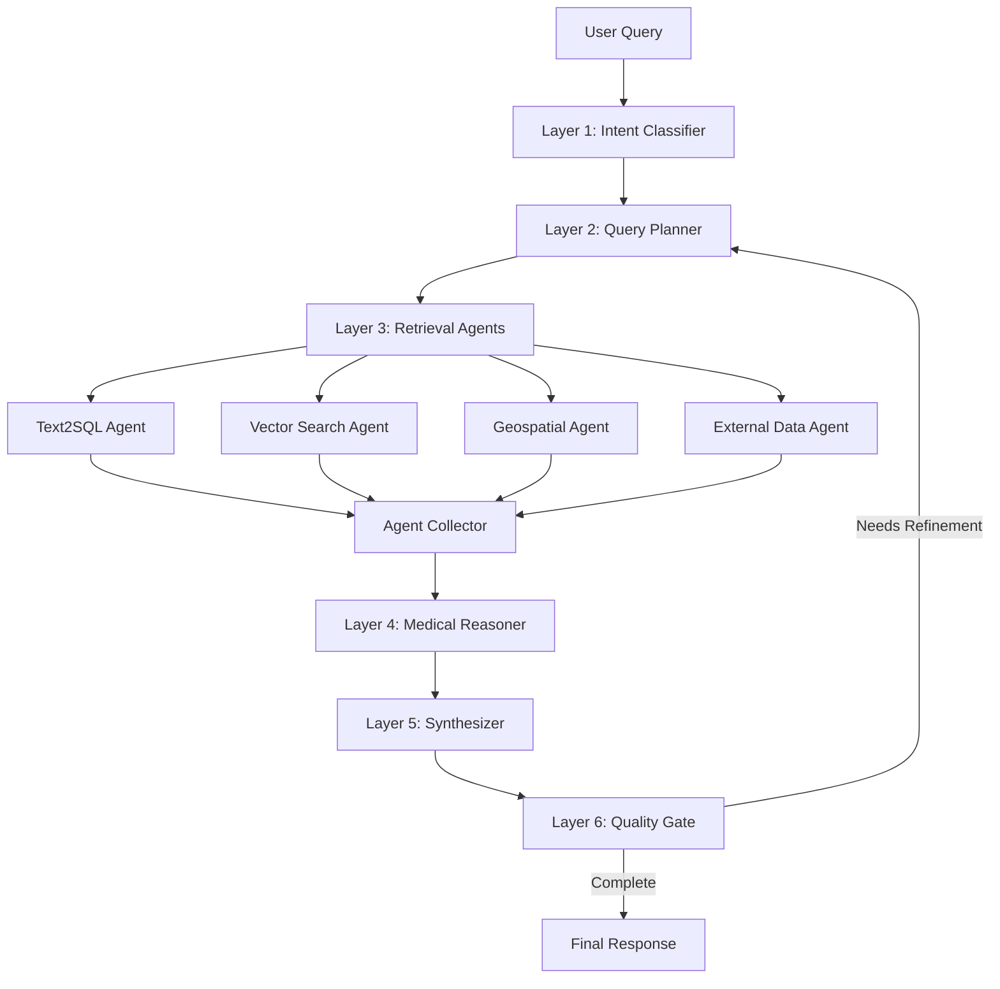

# VF Healthcare Intelligence Agent

> **AI-Powered Healthcare Access Intelligence for Global Health Equity**

An agentic AI system that analyzes healthcare facility data, identifies service gaps, and provides actionable insights for NGOs and policymakers working to improve healthcare access in underserved regions. Built for the [Virtue Foundation](https://virtuefoundation.org/)'s global healthcare access initiative.

[](https://www.python.org/downloads/)
[](https://github.com/langchain-ai/langgraph)
[](https://fastapi.tiangolo.com/)
[](https://nextjs.org/)
[](LICENSE)

---

## Table of Contents

- [Overview](#overview)
- [Key Features](#key-features)
- [Architecture](#architecture)
- [Tech Stack](#tech-stack)
- [Quick Start](#quick-start)
- [Usage](#usage)
- [API Reference](#api-reference)
- [Project Structure](#project-structure)
- [Configuration](#configuration)
- [Example Queries](#example-queries)
- [Documentation](#documentation)
- [Contributing](#contributing)
- [Roadmap](#roadmap)
- [License](#license)
- [Acknowledgments](#acknowledgments)

---

## Overview

The VF Healthcare Intelligence Agent is an AI system designed to help healthcare planners, NGOs, and policymakers make data-driven decisions about healthcare resource allocation. It currently focuses on **Ghana's healthcare landscape** with 987 healthcare facilities.

### The Problem

Healthcare planners in underserved regions face critical challenges:

- **Data Fragmentation** -- Facility data is scattered across unstructured documents and spreadsheets
- **Invisible Service Gaps** -- Difficulty identifying underserved areas ("medical deserts")
- **Poor Resource Allocation** -- Limited tools for optimizing NGO project placement
- **Data Quality Issues** -- Inconsistent facility information, missing fields, unverified claims
- **Analytical Barriers** -- Complex geospatial and medical analysis requires technical expertise

### Our Solution

An AI agent that understands natural language and medical terminology to provide instant, cited insights:

- **Natural Language Interface** -- Ask questions like _"Where are the cardiology medical deserts?"_
- **Medical Intelligence** -- Automatically expands terms (_"heart doctor"_ &rarr; _"cardiology"_) and validates data
- **Multi-Source Analysis** -- Combines SQL queries, semantic search, geospatial analysis, and WHO benchmarks
- **Interactive Visualization** -- Real-time map highlighting facilities and service gaps
- **Intelligent Document Parsing** -- Extract structured data from PDFs, images, and unstructured text
- **Citation Tracking** -- Every claim backed by source evidence with row-level provenance

---

## Key Features

### Intelligent Query Processing

- **Multi-Agent Pipeline** -- Specialized agents (Text2SQL, Vector Search, Geospatial, External Data) work in parallel
- **Medical Term Expansion** -- Understands informal queries and maps them to clinical terminology
- **Intent Classification** -- Automatically categorizes queries into 11 types for optimal routing
- **Quality Gate** -- Self-correcting feedback loop ensures accurate, complete responses

### Healthcare-Specific Capabilities

- **Medical Desert Detection** -- Identifies underserved geographic areas by specialty
- **Anomaly Detection** -- Flags data quality issues (e.g., cardiology claims without equipment)
- **WHO Benchmarking** -- Compares metrics against international guidelines
- **Workforce Analysis** -- Doctor-to-bed ratios, specialist distribution, staffing levels
- **NGO Coordination** -- Identifies overlapping projects and coverage gaps

### Geospatial Intelligence

- **Distance Calculations** -- Find nearest facilities by specialty
- **Coverage Analysis** -- Identify areas beyond X km from any facility
- **Regional Comparisons** -- Compare service availability across districts
- **Population Integration** -- Factor in demographic data for need assessment

### Intelligent Document Parsing (IDP)

- **Multi-Format Extraction** -- Process PDFs, images, and free-form text
- **Confidence Scoring** -- Per-field confidence scores for extracted data
- **Verification Workflow** -- Split-view interface for human review of AI-extracted data
- **Deduplication** -- Embedding-based duplicate detection with LLM-assisted merging

### User Interfaces

| Interface | Description | Port |
|-----------|-------------|------|
| **HealthSync App** | Admin dashboard for data management, verification, and analytics | `3000` |
| **Map Explorer** | Interactive map with chat panel for visual exploration | `3001` |
| **REST API** | FastAPI backend with Swagger docs | `8000` |
| **CLI** | Rich terminal interface for power users | -- |

---

## Architecture

### AI Pipeline

The system uses a **LangGraph-based pipeline** with two modes:

**Lite Pipeline** (default, 2 LLM calls) -- Used in production for fast responses:

```
User Query → Text2SQL + Synthesis → Response
```

**Full Pipeline** (6 layers, 8+ LLM calls) -- Available for deep analysis:



### System Architecture

```
                    ┌─────────────────────────────────────────┐
                    │              Frontend Layer              │
                    │                                         │
                    │  ┌──────────────┐  ┌─────────────────┐  │
                    │  │ HealthSync   │  │  Map Explorer   │  │
                    │  │ (Vite+React) │  │  (Next.js 15)   │  │
                    │  └──────┬───────┘  └────────┬────────┘  │
                    └─────────┼───────────────────┼───────────┘
                              │                   │
                    ┌─────────┼───────────────────┼───────────┐
                    │         ▼      FastAPI       ▼          │
                    │  ┌────────────┬──────────┬───────────┐  │
                    │  │ CRUD API   │ Query API│  IDP API  │  │
                    │  └────────────┴──────────┴───────────┘  │
                    └─────────────────────┬───────────────────┘
                                          │
                    ┌─────────────────────┼───────────────────┐
                    │         AI Pipeline │(LangGraph)        │
                    │                     ▼                   │
                    │  ┌─────────────────────────────────┐    │
                    │  │  Text2SQL · Vector Search        │    │
                    │  │  Geospatial · Medical Reasoning  │    │
                    │  └─────────────────────────────────┘    │
                    └─────────────────────┬───────────────────┘
                                          │
                    ┌─────────────────────┼───────────────────┐
                    │         Data Layer  │                    │
                    │    ┌────────┐  ┌────┴────┐  ┌────────┐  │
                    │    │ SQLite │  │  FAISS  │  │  CSV   │  │
                    │    │ /DuckDB│  │ Vectors │  │ Source │  │
                    │    └────────┘  └─────────┘  └────────┘  │
                    └─────────────────────────────────────────┘
```

---

## Tech Stack

| Layer | Technologies |
|-------|-------------|
| **AI/ML** | LangGraph, OpenAI GPT-4o, FAISS, LangChain, Pydantic |
| **Backend** | FastAPI, DuckDB/SQLite (dev), PostgreSQL (prod) |
| **Frontend** | Next.js 15, Vite + React, Tailwind CSS, shadcn/ui, Leaflet |
| **Data** | 987 Ghana healthcare facilities (Virtue Foundation dataset) |
| **DevOps** | Task runner, Docker (optional), MLflow tracing (optional) |

---

## Quick Start

### Prerequisites

- **Python** 3.10+
- **Node.js** 18+
- **OpenAI API Key**

### Installation

1. **Clone the repository**
   ```bash
   git clone <repo-url>
   cd Ai_for_global_healthcare_access
   ```

2. **Set up Python environment**
   ```bash
   python -m venv .venv

   # Windows
   .venv\Scripts\activate

   # macOS/Linux
   source .venv/bin/activate

   pip install -e .
   ```

3. **Configure environment variables**
   ```bash
   cp .env.example .env
   # Edit .env and add your OpenAI API key
   ```

4. **Install frontend dependencies**
   ```bash
   cd map && npm install && cd ..
   cd healthsync-app && npm install && cd ..
   ```

### Running the Application

**Option A: Start everything at once** (requires [Task](https://taskfile.dev/)):
```bash
task dev
```
This starts all three services in parallel:
| Service | URL |
|---------|-----|
| HealthSync App | http://localhost:3000 |
| Map Explorer | http://localhost:3001 |
| Backend API | http://localhost:8000/docs |

**Option B: Start services individually:**
```bash
# Terminal 1 — Backend API
uvicorn api.server:app --reload --host 0.0.0.0 --port 8000

# Terminal 2 — HealthSync App
cd healthsync-app && npm run dev -- --port 3000

# Terminal 3 — Map Explorer
cd map && npm run dev -- -p 3001
```

**Option C: CLI only** (no frontend needed):
```bash
python main.py
```

---

## Usage

### CLI Interface

```bash
# Interactive REPL
python main.py

# Ask a question
> How many hospitals have cardiology?

# Single query mode
python main.py "Where are the medical deserts for ophthalmology?"

# Verbose logging
python main.py --verbose
```

### REST API

```bash
# Query the AI agent
curl -X POST http://localhost:8000/api/query \
  -H "Content-Type: application/json" \
  -d '{"question": "How many hospitals have cardiology?"}'
```

### Data Ingestion

```bash
# Ingest a CSV file into the database
python scripts/run_ingest.py "ghana_dataset/Virtue Foundation Ghana v0.3 - Sheet1.csv" --limit 10
```

### Map Data Preparation

```bash
# Generate JSON files for the map frontend
python scripts/prepare_map_data.py
```

---

## API Reference

### Query Endpoint

**`POST /api/query`** -- Process a natural language healthcare query.

```json
// Request
{ "question": "How many hospitals have cardiology?" }

// Response
{
  "synthesis": "There are 23 hospitals offering cardiology services...",
  "citations": [{ "facility_name": "Korle Bu Teaching Hospital", "data_source": "text2sql", "evidence": "..." }],
  "intent": "basic_lookup",
  "required_agents": ["text2sql", "vector_search"],
  "elapsed": 4.2,
  "filters": { "specialty": "cardiology", "types": ["hospital"] },
  "facility_names": ["Korle Bu Teaching Hospital", "..."]
}
```

### CRUD Endpoints

| Method | Endpoint | Description |
|--------|----------|-------------|
| GET | `/api/crud/organizations` | List all organizations |
| GET | `/api/crud/organizations/:id` | Get organization by ID |
| POST | `/api/crud/organizations` | Create organization |
| PUT | `/api/crud/organizations/:id` | Update organization |
| GET | `/api/crud/dashboard/stats` | Dashboard statistics |
| GET | `/api/crud/activity-logs` | Activity log entries |

### IDP Endpoints

| Method | Endpoint | Description |
|--------|----------|-------------|
| POST | `/api/idp/extract` | Extract structured data from documents |

### Utility

| Method | Endpoint | Description |
|--------|----------|-------------|
| GET | `/health` | Health check |
| GET | `/api/docs` | Swagger UI |
| GET | `/api/redoc` | ReDoc |

---

## Project Structure

```
.
├── api/                              # FastAPI REST API
│   ├── server.py                     #   Main app & query endpoint
│   ├── schemas.py                    #   Request/response models
│   ├── crud_router.py                #   CRUD endpoints (organizations, stats)
│   └── idp_router.py                 #   Document parsing endpoint
│
├── src/                              # Core AI pipeline
│   ├── config.py                     #   Configuration (env vars, paths)
│   ├── state.py                      #   LangGraph state definition
│   ├── llm.py                        #   LLM client wrapper
│   ├── graph.py                      #   Full 6-layer pipeline
│   ├── graph_lite.py                 #   Lite 2-call pipeline (default)
│   │
│   ├── nodes/                        #   Pipeline layer implementations
│   │   ├── intent_classifier.py      #     Query categorization
│   │   ├── query_planner.py          #     Medical term expansion
│   │   ├── text2sql_agent.py         #     SQL query generation
│   │   ├── vector_search_agent.py    #     Semantic search (FAISS)
│   │   ├── geospatial_agent.py       #     Distance & coverage analysis
│   │   ├── external_data_agent.py    #     WHO guidelines, population data
│   │   ├── medical_reasoner.py       #     Validation & anomaly detection
│   │   ├── synthesizer.py            #     Answer generation + citations
│   │   └── quality_gate.py           #     Completeness check & refinement
│   │
│   ├── tools/                        #   Utility functions
│   │   ├── sql_executor.py           #     DuckDB/SQLite operations
│   │   ├── vector_search.py          #     FAISS vector operations
│   │   ├── geocoding.py              #     Geospatial utilities
│   │   └── medical_hierarchy.py      #     Medical ontology/term expansion
│   │
│   ├── planning/                     #   Query planning engine
│   │   ├── engine.py                 #     Planning logic
│   │   └── prompts.py                #     Planning prompts
│   │
│   ├── idp/                          #   Intelligent Document Parsing
│   │   └── engine.py                 #     Extraction engine
│   │
│   └── datacleaning/                 #   Data ingestion pipeline
│       ├── pipeline.py               #     Main orchestration
│       ├── parser.py                 #     CSV parsing
│       ├── models.py                 #     Data models
│       ├── db.py                     #     Database connection utilities
│       ├── merge_agent.py            #     LLM-based duplicate merging
│       ├── identity_embedding.py     #     Embedding generation
│       ├── embedding_store.py        #     FAISS embedding storage
│       └── geocode.py                #     Address geocoding
│
├── map/                              # Map Explorer (Next.js 15)
│   ├── app/
│   │   ├── page.tsx                  #   Main map page
│   │   ├── layout.tsx                #   Root layout
│   │   └── components/
│   │       ├── MapView.tsx           #     Leaflet map component
│   │       ├── ChatPanel.tsx         #     AI query interface
│   │       ├── Sidebar.tsx           #     Navigation sidebar
│   │       ├── FacilitiesPanel.tsx   #     Facility list
│   │       ├── LayerPanel.tsx        #     Map layer controls
│   │       └── CoverageInfoCard.tsx  #     Coverage statistics
│   └── package.json
│
├── healthsync-app/                   # HealthSync Dashboard (Vite + React)
│   ├── src/
│   │   ├── pages/                    #   Page components
│   │   │   ├── Dashboard.tsx         #     Stats & analytics
│   │   │   ├── DatabaseView.tsx      #     Organization table
│   │   │   ├── Verification.tsx      #     AI data verification
│   │   │   ├── BulkUpload.tsx        #     CSV/PDF upload
│   │   │   ├── FacilitySettings.tsx  #     Facility detail/edit
│   │   │   └── ActivityLogs.tsx      #     Activity log viewer
│   │   ├── components/               #   Reusable components + shadcn/ui
│   │   ├── i18n/                     #   Internationalization (EN, AR, DE, FR)
│   │   └── contexts/                 #   React context (app state)
│   └── package.json
│
├── ghana_dataset/                    # Source data
│   ├── health.db                     #   SQLite database (987 facilities)
│   └── *.csv                         #   Source CSV dataset
│
├── schema/                           # Database schemas
│   ├── 001_initial.sql               #   PostgreSQL (with pgvector)
│   └── 001_sqlite.sql                #   SQLite
│
├── scripts/                          # Utility scripts
│   ├── run_ingest.py                 #   CSV ingestion
│   └── prepare_map_data.py           #   Generate map JSON data
│
├── prompts_and_pydantic_models/      # LLM prompt templates & schemas
│   ├── organization_extraction.py    #   Organization extraction
│   ├── facility_and_ngo_fields.py    #   Field extraction
│   ├── medical_specialties.py        #   Specialty extraction
│   └── free_form.py                  #   Free-form text extraction
│
├── documentation/                    # Project documentation
│   ├── Ingest-walkthrough.md         #   Data ingestion guide
│   ├── Question Reference.md        #   Query examples for testing
│   ├── sql-integration-guide.md      #   Frontend ↔ DB integration guide
│   └── Theme - *.md                  #   Hackathon challenge description
│
├── main.py                           # CLI entry point
├── pyproject.toml                    # Python dependencies
├── Taskfile.yml                      # Task runner (starts all services)
├── .env.example                      # Environment variable template
└── .gitignore
```

---

## Configuration

### Environment Variables

Create a `.env` file from the template:

```bash
cp .env.example .env
```

| Variable | Required | Default | Description |
|----------|----------|---------|-------------|
| `OPENAI_API_KEY` | Yes | -- | OpenAI API key |
| `OPENAI_MODEL` | No | `gpt-4o` | LLM model name |
| `EMBEDDING_MODEL` | No | `text-embedding-3-small` | Embedding model |
| `USE_MOCK_DB` | No | `true` | Use DuckDB/SQLite (`true`) or PostgreSQL (`false`) |
| `DATABASE_URL` | No | -- | PostgreSQL connection string |
| `ENABLE_TRACING` | No | `false` | Enable MLflow tracing |

### Pipeline Tuning

Key parameters in `src/config.py`:

```python
MAX_QUALITY_ITERATIONS = 3     # Max quality gate refinement loops
EMBEDDING_DIMENSION = 1536     # text-embedding-3-small dimension
TOP_K_VECTOR_RESULTS = 15      # Semantic search results to retrieve
```

---

## Example Queries

**Basic Lookup**
- _"How many hospitals have cardiology?"_
- _"List all facilities in the Greater Accra region"_
- _"What services does Korle Bu Teaching Hospital offer?"_

**Geospatial Analysis**
- _"Where are the medical deserts for ophthalmology?"_
- _"Which region has the most clinics?"_
- _"Find hospitals within 50km of Kumasi"_

**Data Validation**
- _"Which facilities claim cardiology but lack equipment?"_
- _"Find hospitals without emergency services"_
- _"Show facilities with missing specialty data"_

**Workforce Analysis**
- _"What is the doctor-to-bed ratio by region?"_
- _"Which areas have the lowest specialist density?"_

**NGO Coordination**
- _"Where do NGOs have overlapping projects?"_
- _"Which underserved areas lack NGO coverage?"_

**Benchmarking**
- _"How does Ghana's specialist ratio compare to WHO guidelines?"_
- _"Are we meeting WHO standards for maternal care facilities?"_

---

## Documentation

Additional guides are in the [`documentation/`](documentation/) folder:

| Document | Description |
|----------|-------------|
| [Ingest Walkthrough](documentation/Ingest-walkthrough.md) | Step-by-step data ingestion guide |
| [Question Reference](documentation/Question%20Reference.md) | Real-world query examples for testing |
| [SQL Integration Guide](documentation/sql-integration-guide.md) | Connecting the HealthSync frontend to PostgreSQL |
| [Ghana Dataset Schema](ghana_dataset/Virtue%20Foundation%20Ghana%20Dataset.md) | Column definitions and data dictionary |

---

## Contributing

We welcome contributions! Here's how:

1. Fork the repository
2. Create a feature branch (`git checkout -b feature/my-feature`)
3. Make your changes with clear commit messages
4. Ensure code is formatted (`black src/ api/`) and linted (`ruff check src/ api/`)
5. Submit a Pull Request

### Code Quality

```bash
black src/ api/ main.py      # Format
ruff check src/ api/         # Lint
mypy src/ api/               # Type check
pytest                       # Test
```

---

## Roadmap

### Phase 1: MVP (Complete)
- [x] Multi-agent LangGraph pipeline (full + lite)
- [x] FastAPI REST API with CRUD and IDP endpoints
- [x] Next.js map frontend with chat interface
- [x] HealthSync admin dashboard with verification workflow
- [x] Data ingestion pipeline with deduplication
- [x] Ghana dataset (987 facilities)
- [x] CLI interface

### Phase 2: Enhancement (In Progress)
- [ ] PostgreSQL production deployment
- [ ] Connect HealthSync frontend to live API (remove mock data)
- [ ] Comprehensive test suite
- [ ] Performance optimization (caching, query batching)
- [ ] Monitoring and observability

### Phase 3: Scale
- [ ] Multi-country dataset support
- [ ] Real-time data ingestion
- [ ] Advanced ML-based anomaly detection
- [ ] Drive-time isochrone analysis
- [ ] Mobile app for field workers

### Phase 4: Intelligence
- [ ] Predictive modeling (disease outbreak prediction)
- [ ] Resource optimization algorithms
- [ ] Multi-language support (French, Swahili, etc.)
- [ ] Integration with national health information systems
- [ ] Automated report generation for policymakers

---

## License

This project is licensed under the MIT License. See the [LICENSE](LICENSE) file for details.

---

## Acknowledgments

- **[Virtue Foundation](https://virtuefoundation.org/)** -- Mission and healthcare dataset
- **LangChain / LangGraph** -- Agent orchestration framework
- **OpenAI** -- GPT-4o and embedding models
- **Open Source Community** -- The tools that made this possible

---

<div align="center">

**Built for Global Health Equity**

[Back to Top](#vf-healthcare-intelligence-agent)

</div>
